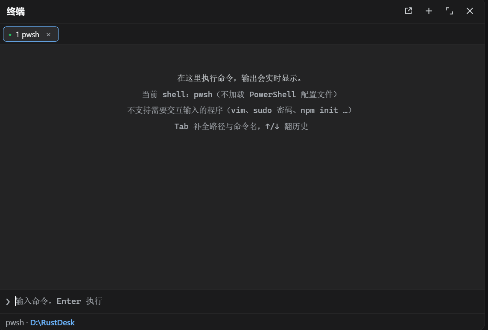

<h1 align="center">dsh-terminal-panel</h1>
<p align="center"><b>让命令、输出与当前工作区待在同一个界面。</b></p>
<p align="center">实时输出 · 多标签 · Tab 补全 · 命令历史 · Ctrl+C 中断</p>
<p align="center">
  <a href="https://www.npmjs.com/package/@easytz/dsh-terminal-panel"></a>
  
  
  
</p>
<p align="center"></p>

> Command panel for [DeepSeek Harness](https://github.com/deepseek-ai/deepseek-harness): streaming output, tabs and completion without leaving the workspace.

<details open>
<summary><b>中文</b></summary>

## 前置要求

- dsh `>= 0.1.1-rc.2`
- `pnpm` 可用（`dsh plugin` 底层转发给 pnpm）

## 安装

最省事的办法是用[插件市场](https://github.com/EasyTZ/dsh-market)：打开「发现」，搜 `terminal`，点「安装」。

命令行：

```sh
dsh plugin --profile <name> add @easytz/dsh-terminal-panel
```

`<name>` 是**必填**的 profile 名，不能省略——桌面版通常是 `web`，TUI 是 `tui`；不确定就看 `$DSH_HOME/profiles/` 下的目录名。想钉死版本就写 `@easytz/dsh-terminal-panel@0.2.7`。

插件自带 `dsh.bundle` 层（`cordis.patch.yml`），`dsh plugin add` 会同时完成「装进去」和「注册激活」，**不需要手写 patch**。

装完重启 dsh，侧边栏底部出现终端按钮。

## 用法

点侧边栏底部的**终端**按钮打开面板。

**敲命令.** 最底下那行输入框，Enter 执行，输出实时往上刷（不是跑完才一次性给）。每条命令跑完会显示退出码，非零一眼看得出来。

**当前目录.** 命令默认在当前工作区根目录执行，面板底部状态栏显示用的是哪个 shell、当前在哪个目录。注意**每条命令是独立进程**，`cd` 不会跨命令保留——面板自己跟踪并展示当前目录，所以你 `cd` 之后下一条命令仍然在新目录里跑。

**补全与历史.** `Tab` 补全文件路径和 `PATH` 上的命令名，`↑` / `↓` 翻命令历史。

**多标签页.** 标题栏的 **+** 开一个新标签（最多 8 个），标签上的 **×** 关掉。一个标签跑着长任务时可以开新标签干别的。

**中断.** `Ctrl+C` 中断正在跑的命令。命令跑着的时候输入框会提示「命令运行中 · Ctrl+C 终止」。

**最大化.** 标题栏的最大化按钮把面板铺满，再点一次还原。

**跑不了的东西怎么办.** 需要接管整个屏幕的交互式程序（`vim`、`sudo` 输密码、`npm init` 的问答）在这里跑不了，见下面「已知限制」。标题栏最左边那个按钮是**在系统终端中打开**，一键在系统自带终端里打开同一个目录，接着干。

## 卸载

```sh
dsh plugin --profile <name> remove @easytz/dsh-terminal-panel
```

`<name>` 与安装时一致。`remove` 会把包从 profile 依赖里移除，dsh 随后会把它从激活清单（`dsh.profile.bundles`）里撤掉。重启 dsh 后按钮消失。

> 如果你按旧版 README 手动往 `$DSH_HOME/profiles/<name>/cordis.patch.yml` 或 `$DSH_HOME/cordis.patch.yml` 里加过 `- insert:` 条目，卸载时把那段 YAML 一起删掉。

## 已知限制

- **它不是 PTY，是命令控制台**。跑不了全屏交互程序：`vim`、`sudo` 密码输入、`npm init` 问答这类需要终端接管屏幕的程序都无法使用——面板里明说了这一点，并提供「在系统终端中打开」作为替代。要做满血终端，正确路线是宿主侧接 node-pty，而不是往这个面板里塞。
- **每条命令是独立进程**，`cd` 不会跨命令保留（面板自己跟踪并展示当前目录）。
- Windows 上命令通过 `pwsh -NoLogo -NoProfile -NonInteractive` 执行；macOS 上是 `bash -c`（不读 rc 文件）——这是 dsh 内核按平台选择的执行器，不是插件的行为。

## 平台支持

已在 Windows 与 macOS 上验证；macOS 包含 GUI 启动场景的登录 shell PATH 探测兜底，Linux 使用同一套 POSIX 路径。

</details>

<details>
<summary><b>English</b></summary>

A third-party plugin for [DeepSeek Harness](https://github.com/deepseek-ai/deepseek-harness) (dsh) that adds a **command console** to the sidebar.

### Requirements

- dsh `>= 0.1.1-rc.2`
- `pnpm` available (`dsh plugin` shells out to pnpm)

### Install

Easiest path is the [plugin market](https://github.com/EasyTZ/dsh-market): open **Discover**, search `terminal`, hit **Install**.

From the command line:

```sh
dsh plugin --profile <name> add @easytz/dsh-terminal-panel
```

`<name>` is **required** — your dsh profile (usually `web` for the desktop/web UI, `tui` for the TUI). The package ships its own `dsh.bundle` layer, so `dsh plugin add` both installs **and** activates it.

Restart dsh — a terminal button appears at the bottom of the sidebar.

### Usage

Click the terminal button to open the panel.

- **Run a command.** Type in the input at the bottom, press Enter. Output streams in live; the exit code is shown when the command finishes.
- **Working directory.** Commands run in the current workspace. Each command is its own process, so `cd` doesn't persist at the process level — the panel tracks the current directory for you and shows it in the status bar.
- **Completion and history.** `Tab` completes file paths and command names on `PATH`; `↑`/`↓` walk the history.
- **Tabs.** **+** in the header opens another tab (up to 8), useful while a long task runs in the first one.
- **Interrupt.** `Ctrl+C` stops the running command.
- **Maximize.** The header button expands the panel to fill the window; click again to restore.
- **Open in system terminal.** The leftmost header button opens your OS terminal at the same directory — use it for anything interactive (see below).

### Uninstall

```sh
dsh plugin --profile <name> remove @easytz/dsh-terminal-panel
```

### Limitations

- **This is a command console, not a PTY.** Full-screen interactive programs (`vim`, `sudo` password prompts, `npm init` questionnaires) cannot run here. The panel says so and offers "open in system terminal" instead.
- **Each command is a separate process**, so `cd` isn't preserved at the process level (the panel tracks and displays the directory itself).
- On Windows commands run through `pwsh -NoLogo -NoProfile -NonInteractive`; on macOS through `bash -c` (no rc files). That's the dsh kernel's per-platform executor, not this plugin.
- Verified on Windows only; macOS has a login-shell PATH fallback but is untested. Feedback welcome.

</details>

## 许可证 / License

[MIT](LICENSE)
